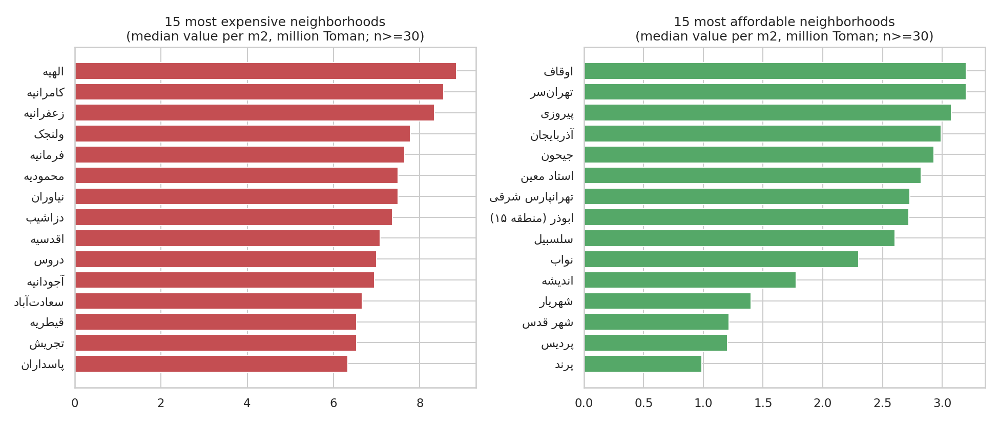
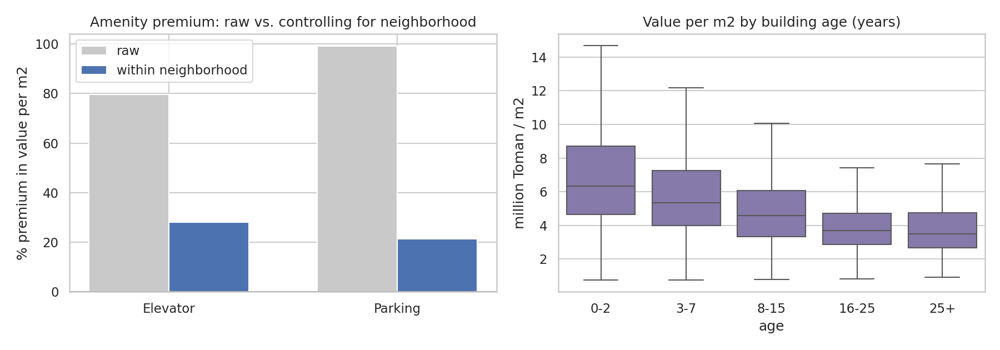
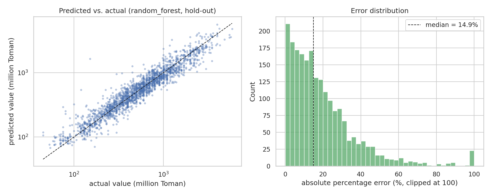
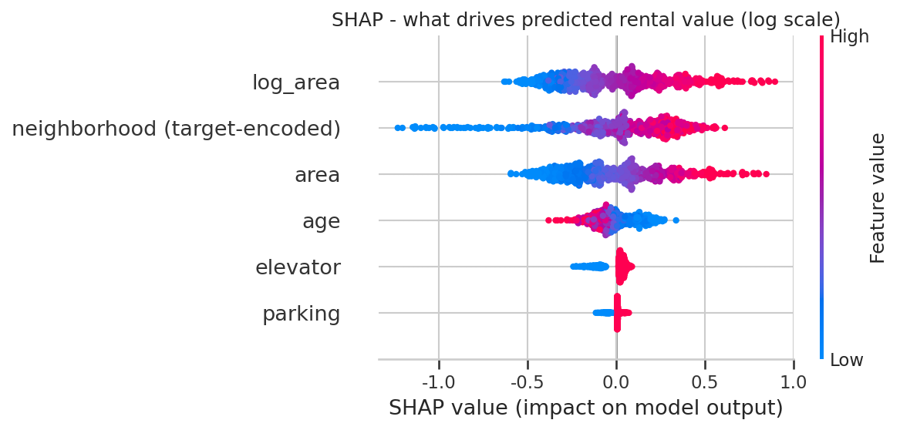

# 🏠 Tehran Rental Market Analysis

[](https://tehran-rental-market-wd3wkangw4qpw9sn2kuuwb.streamlit.app/)
[](https://github.com/ebixs/tehran-rental-market)
[](LICENSE)

A data-cleaning, exploratory-analysis and machine-learning project on ~12k real Tehran rental listings from Divar. It answers three practical questions:


1. **How messy is real listing data, and how do you clean it defensibly?**
2. **Where is Tehran expensive, and what do amenities really add once location is controlled for?**
3. **Can we estimate a fair rental value for a new listing, with an honest uncertainty range?**

`Python` · `pandas` · `scikit-learn` · `XGBoost` · `SHAP` · `Streamlit` · `pytest` · Persian-text handling (`arabic-reshaper`, `python-bidi`)

## Why this project is different from the usual "Tehran house price" demo

- **Rentals, not sales.** Iranian rentals combine a lump-sum *deposit* (ودیعه / رهن) with optional *monthly rent* (اجاره). The project builds a documented **deposit-equivalent** value so listings are comparable, and tests how sensitive the results are to that convention.
- **Auditable cleaning.** Every rule is logged (`reports/cleaning_report.json`); 12,383 raw rows become 10,544 clean rows.
- **Confounding, shown not asserted.** Raw medians say elevators/parking add +80-100%; controlling for neighborhood cuts that to +21-28%.
- **Uncertainty included.** Each estimate ships with an 80% prediction range (81.0% empirical coverage on held-out data).
- **Persian-native.** Text normalisation (Arabic vs Persian letters) and correctly rendered Persian labels in all charts.

## Key findings

| Finding | Evidence |
|---|---|
| Location dominates: a ~9x price gap per m² | Median value per m²: الهیه 8.9, کامرانیه 8.6, زعفرانیه 8.3 vs. شهریار 1.4, پردیس 1.2, پرند 1.0 (million Toman) |
| 37.5% of listings are full-deposit (no monthly rent) | In the 15 busiest neighborhoods the share ranges from 26% to 44% |
| Amenity premiums are mostly a location effect | Elevator: +80% raw vs **+28%** within neighborhood; parking: +99% raw vs **+21%** |
| Size and location explain most of the price | SHAP: area and neighborhood level dominate, then building age, elevator, parking |
| Raw data is dirty | 12% of rows had no price, absurd areas (300,000 m²), and 98 listings share the placeholder rent `100,000` |




## Model results (hold-out set, 2,109 listings)

| Metric | Value |
|---|---|
| R² (log scale) | **0.910** |
| Median absolute % error | **14.9%** |
| Within ±20% of actual | 62.5% |
| Within ±30% of actual | 80.3% |
| MAE | 147 million Toman |
| 80% prediction interval coverage | 81.0% |

5-fold CV on the training split:

| Model | R² (log) | Median APE | Within ±20% |
|---|---|---|---|
| **Random forest** (selected) | 0.902 | 15.8% | 60.3% |
| XGBoost | 0.906 | 16.1% | 60.0% |
| Ridge | 0.885 | 18.1% | 55.1% |

Error is fairly uniform across market segments (median APE 14.3-16.8% across neighborhood-price quartiles), slightly worse in the priciest areas.




### Robustness to the rent→deposit conversion

Converting rent to deposit requires a constant (default: 1 Toman of monthly rent ≈ 30 Toman of deposit). The neighborhood price ranking barely changes when the constant varies (Spearman ρ ≥ 0.947 vs. the baseline for 10-100). Model accuracy figures are **not** comparable across constants because the target itself changes, so the constant was fixed a priori and not tuned for accuracy.

| Constant | Neighborhood-rank ρ vs. 30 |
|---|---|
| 10 | 0.947 |
| 30 (default) | 1.000 |
| 50 | 0.993 |
| 100 | 0.948 |

## Quick start

```bash
git clone https://github.com/ebixs/tehran-rental-market.git
cd tehran-rental-market
python -m venv .venv && source .venv/bin/activate
make install     # dependencies + editable install
make data        # downloads the raw CSV (not committed to the repo)
make all         # data -> eda -> train -> evaluate -> sensitivity -> tests
make app         # Streamlit estimator
```

Estimate a listing from Python:

```python
import pandas as pd
from rental.predict import estimate
print(estimate(pd.DataFrame([{"neighborhood": "سعادت‌آباد", "area": 100,
                              "year": 1390, "elevator": 1, "parking": 1}])))
```

## Project structure

```
tehran-rental-market/
├── app/streamlit_app.py            # estimator with range + deposit/rent combos
├── data/README.md                  # source, column dictionary
├── notebooks/01_cleaning_eda_modeling.ipynb
├── reports/                        # figures/, metrics.json, cleaning_report.json, sensitivity.csv ...
├── src/rental/
│   ├── config.py                   # all constants & cleaning thresholds in one place
│   ├── data.py                     # download, Persian normalisation, logged cleaning rules
│   ├── features.py                 # age, log-area, target-encoded neighborhood
│   ├── pipeline.py                 # candidate models in one sklearn Pipeline
│   ├── train.py                    # CV comparison, hold-out test, prediction interval
│   ├── evaluate.py                 # diagnostics + SHAP
│   ├── eda.py · sensitivity.py · plotting.py · predict.py
├── tests/test_pipeline.py          # network-free tests on synthetic data
└── Makefile · pyproject.toml · requirements.txt
```

## Method notes

- **Target:** `log(1 + deposit-equivalent)` where deposit-equivalent = deposit + 30 × monthly rent (million Toman).
- **Neighborhood encoding:** ~311 levels, so smoothed target encoding fitted *inside* each CV fold (no leakage), not one-hot.
- **Building age:** Jalali build year subtracted from reference year 1400 (newest buildings in the data are from 1399).
- **Dropped columns:** `total_value` (equals deposit + 0.03 × rent, i.e. essentially the deposit) and `warehouse` (almost constant).
- **Interval:** empirical 10th/90th percentile of out-of-fold residuals in log space.

## Limitations

- **Asking prices, not signed contracts**, from a single snapshot around 1399-1400 with no time dimension; Iranian inflation means these Toman values are not current prices.
- The data include some satellite cities (e.g. پرند, شهریار) alongside Tehran neighborhoods, which is why the "cheapest" end of the ranking is outside the city proper.
- No floor number, number of rooms, or coordinates in the source, so within-neighborhood variation is only partly explained.
- The rent→deposit constant is a market convention, not a measured quantity (see the robustness check).

## Data

Listings originally collected from public Divar ads and obtained from the public repository [amiralimadadi/Regression_TheranHousing](https://github.com/amiralimadadi/Regression_TheranHousing). The raw file is downloaded by `make data` rather than redistributed; see [`data/README.md`](data/README.md).

## Possible extensions

Add a time dimension with fresh, terms-compliant data collection; add room count and floor; geocode neighborhoods for maps; quantile-regression or conformal intervals; Dockerfile and CI.

## 👤 Author

**Ebrahim Salimi Bani**
- **GitHub:** [@ebixs](https://github.com/ebixs)
- **LinkedIn:** [Ebrahim Salimi Bani](https://www.linkedin.com/in/ebrahim-salimi-bani/)
- **Live Demo:** [Tehran Rental Predictor](https://tehran-rental-market-wd3wkangw4qpw9sn2kuuwb.streamlit.app/)


## License

MIT, see [LICENSE](LICENSE).


---
